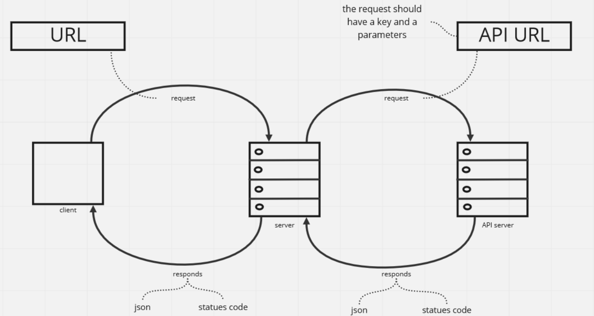

# Project Name - Movies Library

**Author Name**: ahmad alanati

## WRRC

## Overview

## Getting Started
<!-- What are the steps that a user must take in order to build this app on their own machine and get it running? -->
1. clone the repo
2. go to the dirctory where the software is
3. type this command in your terminal "npm init -y"
4. type this command in your terminal "npm install express"
5. go to package.json
6. look for the main proparty and make it = "server.js"

## Project Features
<!-- What are the features included in you app -->

## reference
1. [res.status](https://www.geeksforgeeks.org/express-js-res-status-function/)
2. [the API used](https://www.themoviedb.org/)